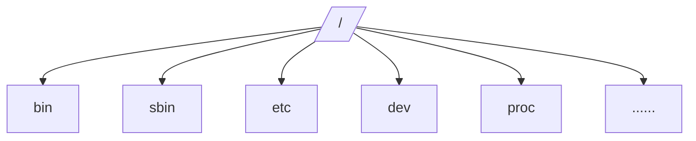

>首次接触GNU/Linux，边学习边写出了这一篇博客，一方面为了巩固自身的知识，另一方面希望可以给其他刚入门的朋友提供一点点帮助。如果有内容有错误或者不准确欢迎指正。
>本篇及系列文章均在CentOS虚拟机上展开。

## 首先，什么是GNU/Linux？                 
 GNU/Linux是一套*免费的、开放源代码的，并可以自由传播* 的类UNIX操作系统。　　
看到这里大家也能明白一些GNU/Linux的特点了吧？没错，就是**免费、开放源码、自由传播**！所以GNU/Linux吸引了很多技术社区用户的加入，并对其不断地完善。由于其开放源码特性，我们也可以在使用中对其根据我们的习惯喜好进行更改。

但是GNU/Linux不仅仅这一个特点，还有就是他的系统*稳定性以及安全性* 。就是因为稳定和安全，所以GNU/Linux成为了公司、企业等选择服务器操作系统的第一选择。有例为证：**现今世界500强的超级计算机都在用GNU/Linux！**
所以，我们选择学习GNU/Linux，因为他的*免费、开源、稳定、安全*。

<br>
<br>　

## GNU/Linux目录 
***
和Windows操作系统的目录不一样，GNU/Linux的目录是呈树形的。

/：根目录，整个系统中最重要的目录，所有的目录都在根目录下。只有root权限才能在此目录下进行写操作。
<br>
<br>   

## GNU/Linux用户
***
 GNU/Linux中分有两种用户：
 1. root用户：即系统的管理员用户，拥有最高权限。提示符为#。
 3. 普通用户：权限低。提示为$。             

一般日常操作建议用*普通用户* ，root用户因为权限过高容易发生误操作。

<br>
<br>

## GNU/Linux界面
***
GNU/Linux拥有两种界面，图形界面类似于Windows，而文字界面就是我们以往对GNU/Linux的印象了。

两种界面:看具体版本，有的GNU/Linux只有文字界面。

**图形界面：**


**文字界面：**

*在GNU/Linux中，我们常常使用文字界面，图形界面用的很少。*
<br>
<br>

## GNU/Linux文件信息
*[文件信息]:不知道这个名字起的贴切否=_= 
***
先上文件来说明

* 最前面的 -rw-rw-rw-. 指的是文件类型及权限
    1. 第一个字符，如果为d表示是文件夹，如果为-表示是文件，还有其他字符，但是这两个比较常见。下面第一个图就是文件夹，第二个是一个.c文件


    2.  第2~4个字符，由rwx三个字符组成。表示*拥有者* 对文件的权限。
r：可读，rwx中首位
w：可写，第二位
x：可执行，第三位
如果拥有对应权限相应位置就会显示对应字符，如果没有权限显示 -
例：拥有读写，没有执行权限：rw-
拥有读，执行，没有写权限：r-x
    3. 第5~7个字符，同样由rwx组成。表示*所在组* 对文件的权限。
    4. 最后三个字符，表示*其他用户* 对文件的权限
* 1指的是文件硬链接的次数
* 第一个root指的是文件的拥有者
* 第二个root 指的是文件所在的组
* 后面的数字69指的是文件大小
* Feb 29 20：07指创建时间
* hello.c是文件名/文件夹名
<br>
<br>
## Shell命令
* #### 命令提示符
```linux
[username@host ~]#
```
    username：当前用户名。
    host：主机名。
    ~：当前目录。
    #：提示符，root用户为#，普通用户为$。
* #### 命令格式
```linux
$ Command [-Options] Argument1 Argument2 ......
```
    * $：命令提示符
    * Command：命令，严格区分大小写
    * option：选项，可有可无
    * argument：参数    
例子：
```linux
[root@chenxuan TEXT1]# rm -f hello.c 
```
    rm：删除文件或文件夹（命令）
    -f：强制执行，不进行询问 （选项）
    hello.c：被删除的文件（参数）
<br>
<br>


　