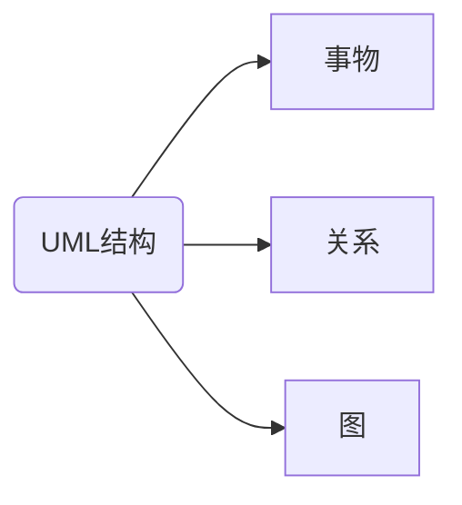
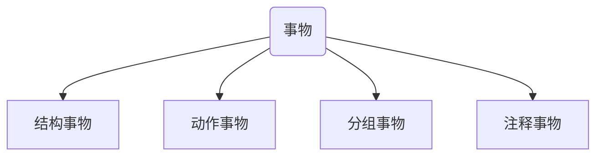
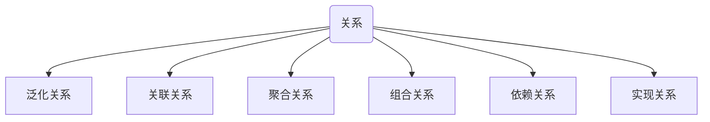
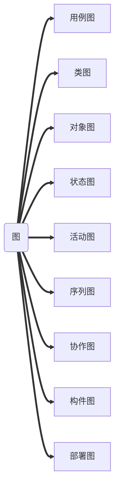

# UML结构体系

> 事物是对模型中最具代表性的成分的抽象
>
> 关系把事物结合在一起
>
> 图聚集了相关的事物

### UML的结构

***

有**3**种基本的构造块：

	1. 事物（元素）
 	2. 关系
 	3. 图



### 事物

***

UML中的事物也称为建模元素。



1. **结构事物**：UML模型的静态部分，描述概念或物理元素。

   1. ```mermaid
      graph TD
      A(结构事物)-->B[类]
      A-->C[接口]
      A-->D[协作]
      A-->E[用例]
      A-->F[主动类]
      A-->G[构件]
      A-->H[节点]
      ```

   2. **类**：具有相同的属性和相同操作，相同关系相同语义的对象的描述

   3. **接口**：描述元素的外部可见行为，即服务集合的定义说明。

   4. **协作**：描述了一组事物间的相互作用的集合

   5. **用例**：代表了一个系统或系统的一部分行为，是一组动作序列的集合

   6. **主动类**：能启动控制活动的类，其对象至少拥有一个线程或进程

   7. **构件**：系统中物理存在，可替换的部件

   8. **节点**：运行时存在的物理元素

2. **行为事物**：UML模型图的*动态部分*，描述跨越空间和时间的行为

   1. ```mermaid
      graph TD
      A(行为事物)-->B[交互]
      A-->C[状态机]
      ```

   2. **交互**：实现某功能的一组构件事物之间的消息的集合，涉及信息、动作序列、链接

   3. **状态机**：描述事物或交互在生命周期内响应事件所经历的状态序列。

3. **分组事物**：UML模型图的**组织部份**，描述事物的组织结构

   1. **包**：把元素组织成组的机制

4. **注释事物**：UML模型图的解释部分，用来对模型中的元素进行说明，解释。

   1. **注解**：对元素进行约束或解释的简单符号。


### [关系](https://blog.csdn.net/caozhangyingfei0109/article/details/8526287)

***

> 类与类，类与接口，接口与接口之间的六大关系。





### [图](https://blog.csdn.net/caozhangyingfei0109/article/details/8534191)

***

> 九种图+包图




